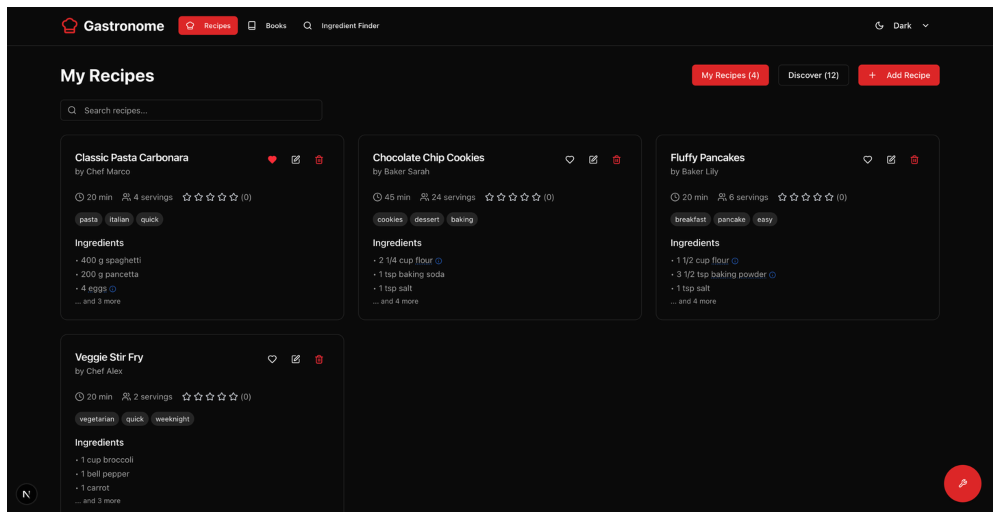
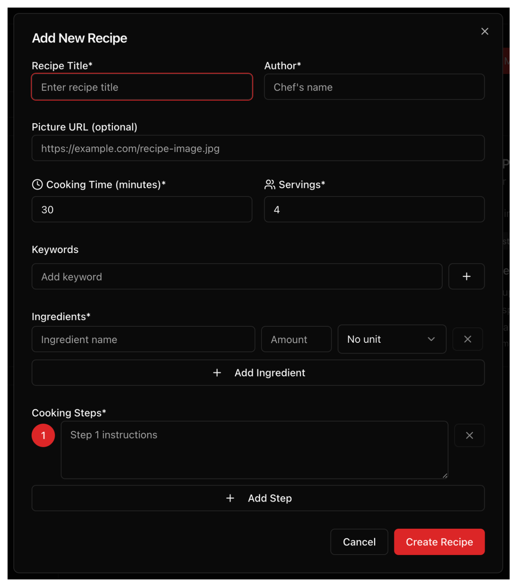
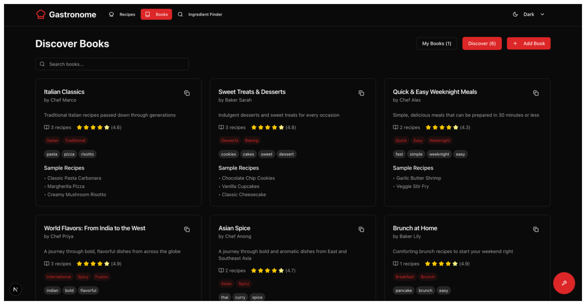
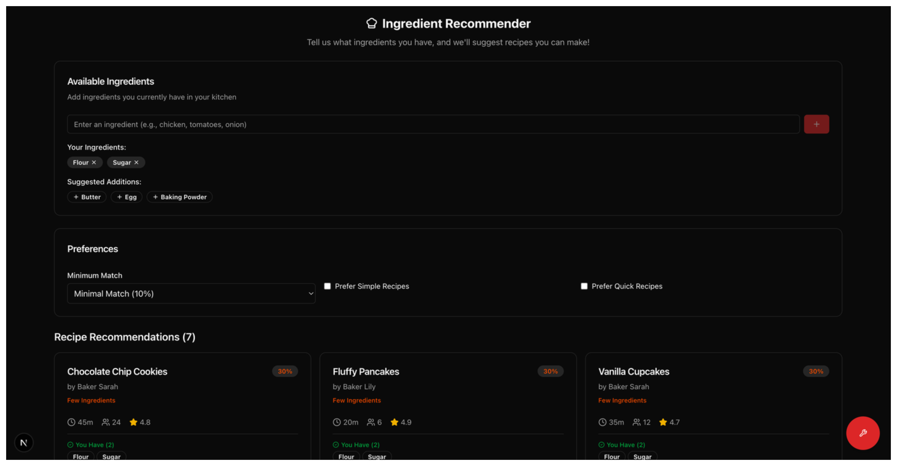
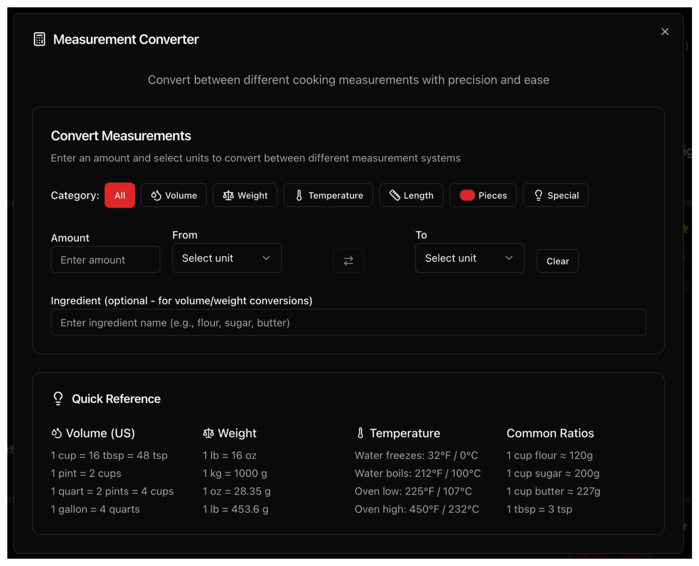
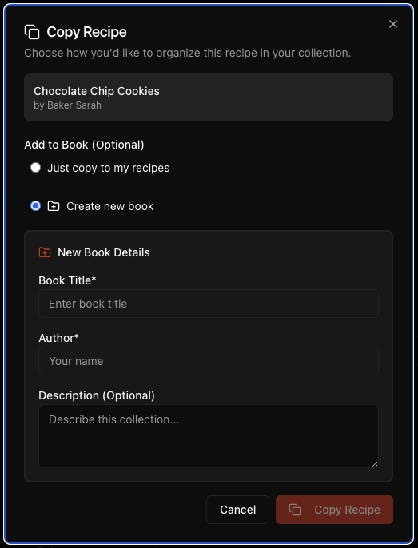

# 🧑‍🍳 Gastronome – Professional Recipe, Books, and Courses Manager

[](https://github.com/Vpwinter/Gastronome)
[](https://www.typescriptlang.org/)
[](https://nextjs.org/)
[](https://gastronome-winter.vercel.app/)

A comprehensive, no-auth cooking application designed for culinary enthusiasts who want to store, discover, and manage recipes, books, and cooking courses. Features intelligent cooking tools including ingredient substitution, measurement conversion, and recipe recommendations.

## 🚀 Live Demo & Links

- **🌐 Production App**: [gastronome-winter.vercel.app](https://gastronome-winter.vercel.app/)
- **📱 GitHub Repository**: [github.com/Vpwinter/Gastronome](https://github.com/Vpwinter/Gastronome)
- **🎨 System Design**: [Excalidraw Architecture](https://excalidraw.com/#json=-Mz9frs-OeGAeLQib_haX,b7LevRmPvkkDdFhU3C7LnA)

## ✨ Key Features Implemented

### 🍳 **Core Recipe Management**
- **Full CRUD Operations**: Create, read, update, and delete recipes with comprehensive validation
- **Rich Recipe Data**: Title, author, images, ingredients with standardized measurements, cooking steps, time estimates, and serving sizes
- **Global Discovery**: Browse and copy recipes shared by the community
- **User Personalization**: Love 💖, rate ⭐, and comment 💬 on recipes
- **Smart Categorization**: Organize recipes with keywords and categories

### 📚 **Book Organization System**
- **Recipe Collections**: Group related recipes into organized books
- **Advanced Copy System**: Smart copy functionality to existing or new books
- **Category Management**: Organize books by cooking styles, cuisines, or themes
- **Cascade Operations**: Efficient bulk operations across recipe collections

### 🧪 **Intelligent Cooking Tools**

#### **Ingredient Recommender**
- **Fuzzy Matching Algorithm**: Advanced ingredient name matching with customizable thresholds
- **"What Can I Make?" Feature**: Input available ingredients and discover compatible recipes
- **Recipe Compatibility Scoring**: Intelligent scoring system with preference filters
- **Smart Suggestions**: Ingredient suggestions based on your cooking history

#### **Substitution Wizard**
- **Comprehensive Database**: 50+ common ingredient substitutions with precise ratios
- **Context-Aware Suggestions**: Different substitutions for baking vs. cooking contexts
- **Allergen-Friendly Alternatives**: Safe substitution options for dietary restrictions
- **Detailed Guidance**: Ratio calculations and usage notes for each substitution

#### **Measurement Converter**
- **Complete Conversion System**: Metric/Imperial conversions for volume, weight, temperature, and length
- **Cooking-Specific Calculations**: Ingredient density calculations for accurate conversions
- **Quick Reference Tools**: Common cooking conversions accessible via floating menu
- **Precision Formatting**: Proper decimal handling for cooking measurements

### 🎨 **User Experience Excellence**
- **4 Theme System**: Light, Dark, Cozy, and Seasonal themes for personalized experience
- **Responsive Design**: Seamless experience across desktop, tablet, and mobile devices
- **Floating Tools Menu**: Quick access to cooking tools while following recipes
- **Accessibility Compliance**: WCAG standards with proper ARIA labels and screen reader support
- **Intuitive Navigation**: Clean, chef-focused UI with shadcn/ui components

## 🛠️ Technology Stack

- **Framework**: Next.js 15 with TypeScript (strict mode)
- **State Management**: Zustand for predictable state handling
- **UI Components**: shadcn/ui with Tailwind CSS
- **Storage**: localStorage for client-side persistence
- **Testing**: Vitest + Testing Library + Playwright (216 tests)
- **Deployment**: Vercel with automatic GitHub integration
- **Code Quality**: ESLint + TypeScript for production-ready code

## 🚀 Quick Start

### Prerequisites
- Node.js 18+ 
- npm, yarn, pnpm, or bun

### Installation

```bash
# Clone the repository
git clone https://github.com/Vpwinter/Gastronome.git
cd Gastronome

# Install dependencies
npm install

# Start development server
npm run dev

# Open browser
open http://localhost:3000
```

### Available Scripts

```bash
# Development
npm run dev          # Start development server
npm run build        # Build for production
npm run start        # Start production server

# Testing
npm test             # Run all tests
npm run test:watch   # Run tests in watch mode
npm run test:ui      # Run tests with UI
npm run test:e2e     # Run end-to-end tests

# Code Quality
npm run lint         # Run ESLint
npm run type-check   # Run TypeScript checks
```

## 📸 Screenshots

### Main Recipe Dashboard

*Browse and manage your recipe collection with advanced filtering and search capabilities*

### Recipe Creation & Management

*Intuitive recipe creation form with rich ingredient management and step-by-step instructions*

### Book Organization System

*Organize recipes into themed collections with smart categorization and easy navigation*

### Intelligent Ingredient Recommender

*Discover recipes based on available ingredients with fuzzy matching and preference filters*

### Advanced Measurement Converter

*Professional cooking conversions with metric/imperial support and ingredient-specific calculations*

### Smart Copy Operations

*Seamless recipe copying between books with intelligent destination selection*

## 🧪 Comprehensive Testing Suite

Our application maintains **216/216 tests passing** with 100% success rate, covering:

### **Component Testing (127 tests)**
- **IngredientRecommender (28 tests)**: UI state management, ingredient input handling, recipe recommendations integration, preferences/filters, error handling, accessibility compliance
- **SubstitutionWizard (29 tests)**: Search functionality, context filtering (All/Baking/Cooking), substitution results display, no results state handling, accessibility validation
- **MeasurementConverter (39 tests)**: Conversion type selection, amount input handling, unit selection, conversion calculations, temperature conversions, error handling, precision formatting
- **BookForm (24 tests)**: Form field interactions, validation logic, store integration, accessibility requirements
- **RecipeCard (22 tests)**: User interactions, love/edit/delete functionality, copy operations, accessibility standards

### **Unit Testing (60 tests)**
- **Store Management (16 tests)**: Recipe/book CRUD operations, data persistence, error handling, state consistency
- **Cooking Data (25 tests)**: Ingredient substitutions, measurement conversions, density calculations, algorithm accuracy
- **Recipe Recommender (19 tests)**: Fuzzy matching algorithms, scoring systems, preference filtering, edge case handling

### **End-to-End Testing**
- **Playwright Integration**: Complete user journey validation across multiple browsers
- **Mobile Responsive**: Touch interaction and mobile-specific workflow testing
- **Accessibility**: Screen reader compatibility and keyboard navigation validation

### **Testing Infrastructure**
- **Performance Optimized**: Test suite runs in 12 seconds (down from 500+ seconds)
- **Professional Setup**: Vitest + Testing Library + Playwright with custom utilities
- **Mock Factories**: Comprehensive test data generation for consistent testing
- **Error Boundary Testing**: Graceful error handling validation
- **Type Safety**: All tests written in TypeScript with strict mode

## 🔮 Future Roadmap

### **🔔 Enhanced User Experience**
- **Change Tracking**: Alert system when original recipes are modified to track improvements
- **Authentication System**: User accounts with secure login and profile management
- **Notifications**: Email and push notifications for recipe updates and recommendations
- **Mobile App**: Native iOS/Android applications with offline capabilities

### **📊 Advanced Features**
- **100% Test Coverage**: Expand testing to cover every code path and edge case
- **AI-Powered Assistant**: Intelligent chatbot for recipe advice and ingredient guidance
- **Enhanced Social Features**: Improved love, rating, and comment systems with social interactions
- **Advanced Search**: AI-powered recipe discovery with natural language queries

### **🏫 Course Management System**
- **Learning Paths**: Structured cooking courses with progress tracking
- **Certification System**: Complete courses and earn cooking certifications
- **Interactive Assessments**: Recipe challenges with photo submission requirements
- **Video Integration**: Step-by-step video tutorials and demonstrations
- **Community Learning**: Peer reviews and collaborative cooking projects

### **🔧 Technical Improvements**
- **Performance Optimization**: Advanced caching and lazy loading strategies
- **Advanced Analytics**: Detailed cooking analytics and ingredient usage tracking
- **API Integration**: Connect with grocery delivery services and nutrition databases
- **Recipe Import/Export**: Support for popular recipe formats and external sources

## 🏗️ Architecture Overview

```
📁 Gastronome/
├── 🎨 src/app/           # Next.js App Router pages
├── 🧩 src/components/    # Reusable UI components
├── 📚 src/lib/           # Utility functions & algorithms
├── 🏪 src/store/         # Zustand state management
├── 🔧 src/types/         # TypeScript type definitions
├── 🧪 src/test/          # Testing utilities & setup
├── 📊 tests/             # E2E and integration tests
└── 📄 docs/              # Documentation & screenshots
```

## 🤝 Contributing

1. Fork the repository
2. Create a feature branch: `git checkout -b feature/amazing-feature`
3. Commit changes: `git commit -m 'Add amazing feature'`
4. Push to branch: `git push origin feature/amazing-feature`
5. Open a Pull Request

## 📄 License

This project is licensed under the MIT License - see the [LICENSE](LICENSE) file for details.

## 🙏 Acknowledgments

- **Next.js Team** for the incredible framework
- **Vercel** for seamless deployment experience
- **shadcn/ui** for beautiful, accessible components
- **Cooking Community** for inspiration and recipe ideas

---

**Built with ❤️ by [Vinicius Winter](https://github.com/Vpwinter)**

*Gastronome - Where Technology Meets Culinary Excellence* 🧑‍🍳✨
